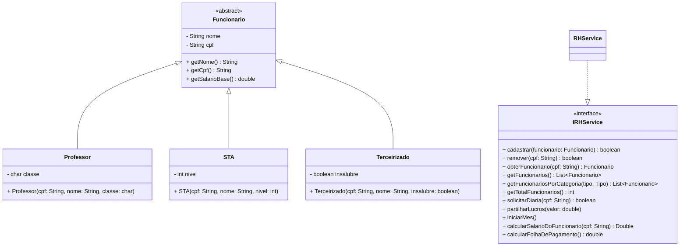

# Gestão universitária

---


Fonte: <a href="https://br.freepik.com/vetores-gratis/ilustracao-do-conceito-de-contador_13766143.htm#fromView=search&page=1&position=6&uuid=54189124-07f3-4a54-9277-02fe2818dad1&query=payroll">Freepik</a>

> Nesta atividade você implementará o sistema que gerencia a folha de pagamento de uma universidade.
A universidade possui três tipos de funcionários, cada um com características específicas: Professores, Servidores Técnicos Adminstrativos e Terceirizados.


## 🎯 Requisitos Funcionais

### ✅ Cadastrar funcionário
* Permitir o cadastro de um funcionário, informando:
    * CPF (único)
    * Nome
    * Tipo de cargo e características específicas do cargo:
        * Para professores: classe (A, B, C, D, ou E)
        * Para STA: nível (1 a 30)
        * Para terceirizados: adicional de insalubridade (sim/não)
* Não é permitido cadastrar funcionários com CPFs repetidos.

### ✅ Buscar por funcionário  Buscar por funcionário
* Permitir a busca de um funcionário pelo CPF, exibindo seus dados.


### ✅ Remover funcionário
* Permitir a remoção de um funcionário da folha de pagamento, informando seu CPF.

### ✅ Emitir relatórios
* Listar todos os funcionários cadastrados.
* Listar funcionários de um cargo específico (professores, STAs ou terceirizados).
* **As listas devem ser ordenadas pelo nome dos funcionários.**

### ✅ Calcular a folha de pagamento

> O salário mensal de cada funcionário é calculado como: **Salário Base + Participação nos Lucros + Diárias**

- Salário Base
    - Professores
        - São classificados em classes (A, B, C, D, E).
        - A classe determina diretamente o salário base do professor.

| Classe | Salário |
|---|---|
| A | R$ 3.000 |
| B | R$ 5.000 |
| C | R$ 7.000 | 
| D | R$ 9.000 |
| E | R$ 11.000|

- Servidores Técnico-Administrativos (STA)
    - Servidores Técnico-Administrativos são classificados em níveis (1 a 30), que determinam o salário base.
    - Fórmula para o salário base: R$ 1.000 + R$ 100 × nível

- Terceirizados
    - Terceirizados podem receber um adicional por insalubridade.
    - Salário sem insalubridade: R$ 1.000
    - Salário com insalubridade: R$ 1.500

- Participação nos lucros
    - Implementar a divisão igualitária de lucros entre os funcionários cadastrados.
    - Exemplo: Se o lucro total for R$ 500 e houver 5 funcionários, cada funcionário receberá R$ 100.
    - O cálculo do lucro é feito mensalmente

- Diárias
    - Professores têm direito a até 3 diárias.
    - STAs têm direito a 1 diária.
    - Terceirizados não têm direito a diárias.
    - Cada diária vale R$ 100 e o limite de diárias é reiniciado mensalmente.

## 🧱 Diagrama



## Exemplo de execução
```java
public class Runner {

  public static void main(final String[] args) {


    RHService rh = new RHService();
    rh.cadastrar(new Professor("16",  "Jonas", 'C'));
    rh.cadastrar(new Professor("15", "Alessio", 'B'));
    System.out.println("Total de funcionarios = " + rh.getTotalFuncionarios()); //Total de funcionarios = 2

    rh.cadastrar(new STA("43", "Miriam", 10));
    rh.cadastrar(new STA("23", "Lacerda", 5));
    System.out.println("Total de funcionarios = " + rh.getTotalFuncionarios()); //Total de funcionarios = 4

    rh.cadastrar(new Terceirizado("12", "Carla", false));
    rh.cadastrar(new Terceirizado("78", "Adriana", true));
    System.out.println("Total de funcionarios = " + rh.getTotalFuncionarios()); //Total de funcionarios = 6

    rh.remover("12");
    System.out.println("Total de funcionarios = " + rh.getTotalFuncionarios()); //Total de funcionarios = 5
    System.out.println("Total de funcionarios = " + rh.getFuncionariosPorCategoria(IRHService.Tipo.TERC).size());

    rh.solicitarDiaria("16");
    rh.solicitarDiaria("16");
    rh.solicitarDiaria("16");
    rh.solicitarDiaria("23");
    rh.solicitarDiaria("23");

    System.out.println(rh.calcularSalarioDoFuncionario("16")); //7300.0
    System.out.println(rh.calcularSalarioDoFuncionario("23")); //1600.0
    System.out.println(rh.calcularSalarioDoFuncionario("12")); //null
    System.out.println(rh.calcularSalarioDoFuncionario("78")); //1500.0

    rh.iniciarMes();
    rh.partilharLucros(20000);

    for (Funcionario f: rh.getFuncionarios()) {
      System.out.println(f.getNome() + "(cpf=" + f.getCpf() + ") -> salario=" + f.getSalario());
    }
    //Adriana(cpf=78) -> salario=5500.0
    //Alessio(cpf=15) -> salario=9000.0
    //Jonas(cpf=16) -> salario=11000.0
    //Lacerda(cpf=23) -> salario=5500.0
    //Miriam(cpf=43) -> salario=6000.0

    System.out.println("Folha do mes = " + rh.calcularFolhaDePagamento()); //Folha do mes = 37000.0
  }
}
```
